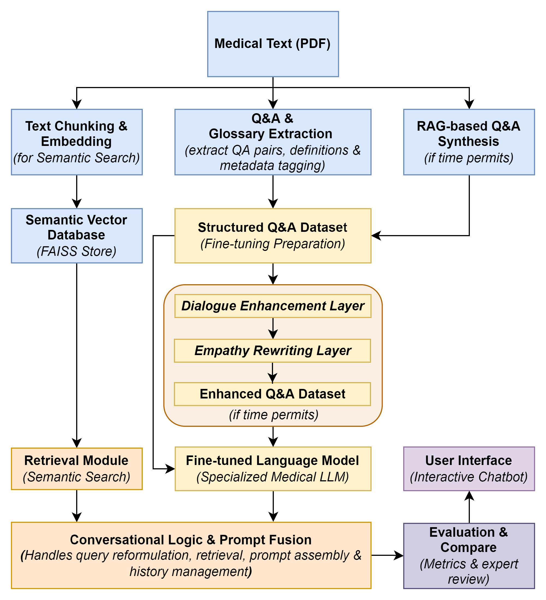

# 基于RAG与微调的共情医疗问答机器人

本项目是我在NLP课程中尝试做的一个实践作业，目的是构建一个具备专业医学知识和人类共情能力的问答机器人。目标是融合RAG以保证医学信息的准确性，并通过LLM的微调来赋予机器人更富同理心的对话风格，最终为用户提供既可靠又温暖的交互体验。

## 系统架构设计

为了实现上述目标，我设计了如下的系统架构。

**架构流程简介:**

1.  **数据准备**: 对医疗文本(PDF)进行处理，包括文本分块、嵌入并存入FAISS向量数据库，同时提取结构化的Q&A和词汇表。
2.  **模型训练**: 基于提取的Q&A数据集，结合对话与共情语料，使用LoRA等参数高效微调方法对语言模型进行训练。
3.  **在线推理**: 用户查询时，系统从FAISS中检索最相关的文本片段，并结合用户问题、上下文历史注入到Prompt中，由微调后的模型生成回答。
4.  **评估与比较**: 通过BLEU、BERTScore等量化指标及专家审查，对比RAG-only模型与微调后模型的性能。
5.  **用户接口**: 提供一个简单的聊天界面进行交互。

## 3. 代码模块说明

本项目包含三个Jupyter Notebook文件，分别代表了项目不同阶段的探索和实现：

* **`Prompt-based_Empathetic_Model.ipynb`**:基线模型。实现了基于RAG的核心问答功能。
    * **技术栈**: 使用FAISS进行高效的向量检索，通过精心设计的Prompt Engineering，在不进行模型微调的情况下，引导基础模型输出带有一定共情色彩的、有理有据的医学回答。
    * **成果**: 该模块验证了RAG架构在提供准确医疗信息方面的有效性，并证明了通过提示工程实现基础共情的可行性。
    
* **`Lora_Fine_tune_with_QA_medical_dataset.ipynb`**:该模块专注于对模型进行领域知识的微调。
    * **方法**: 使用LoRA技术，在一个结构化的医学问答（Q&A）数据集上对模型进行微调，旨在增强其对专业术语和问答模式的理解。
    * **结果**: 微调后的模型在处理单轮、独立的医学问题时表现尚可。但一旦引入对话历史，其性能便显著下降，难以维持上下文连贯性。
    
* **`Lora_Fine_tune_with_Empathy_Dialogue.ipynb`**: 尝试为模型注入核心的共情对话能力。
    * **方法**: 同样采用LoRA技术，但在一个包含共情对话的数据集上进行微调。
    * **结果**: 该方向的微调遇到了较大挑战，未能达到预期效果，模型出现了较为明显的过拟合问题。

## 结果与深度分析

### 取得的成果

1.  **验证了共情与准确性的结合**: 基于Prompt Engineering和RAG的基线模型证明，将富有同理心的表达与FAISS检索出的精准医学知识相结合是完全可行的。
2.  **成功构建RAG架构**: 成功实现了从文档处理、向量化(FAISS)到实时检索的完整RAG流程。
3.  **初步实现了人机交互**: 搭建了可供演示的交互界面，展示了模型的核心能力。

### 挑战与反思

在推进微调的过程中，我遇到了模型性能不升反降的困境。我猜测的失败原因有如下几点。

1.  **训练与推理格式不匹配**:
    * **问题**: 训练数据是简单的`<question>`-`<answer>`对，而实际推理场景却需要模型处理复杂的、包含系统角色、上下文历史和检索知识的Prompt。这种不一致导致模型在训练中学到的能力无法直接迁移到生产环境。
    * **反思**: 模型的微调数据必须尽可能地模拟真实应用场景的输入格式。

2.  **灾难性遗忘与过拟合**:
    * **问题**: 在使用小规模、同质化的Q&A或共情数据集进行微调时，模型虽然学会了新的知识/风格，却忘记了其原有的强大通用对话能力和语言理解能力。尽管使用了LoRA这种参数高效微tuning方法，但数据量过小和Epochs设置可能不当，加剧了对训练数据的过拟合。
    * **反思**: 微调在学习新知识和保留旧知识之间找到平衡。这需要更丰富的混合数据集和更精细的训练策略。

### 改进方向

如果继续推进这个项目，我会从以下几个方面进行改进：

1.  **引入专业NLP框架**:目前的代码是为了理解底层原理而从零搭建。在未来的开发中，可以考虑这些内容：
    
    * **Memory模块**: 专业地管理对话历史，解决我之前遇到的上下文处理难题。
    * **Agent和Chaining**: 更灵活地组合RAG、模型调用和其他工具，实现更复杂的逻辑。
    * **Prompt模板管理**: 系统化地管理和优化不同场景下的Prompt。

2. **数据集构建**:不用简单的Q&A对，构建一个能模拟真实推理格式的指令微调数据集。每一条数据都应包含 `[system_prompt]`, `[retrieved_context]`, `[history]`, `[question]`和理想的`[answer]`。这可能可以解决训练-推理不匹配的问题。

3. **微调策略**:避免将领域知识和对话风格的微调一次性完成。可以分两步走：使用医疗Q&A数据集进行微调。然后在这个基础上，再使用共情对话数据集进行微调

4. **微调参数**:深入探索LoRA的超参数调优，如秩、`alpha`和`target_modules`的选择，找到最适合本任务的配置。同时，也可以尝试QMoE等更新、更高效的微调技术。

   

这是我刚接触NLP这个方向做的第一个项目，实际上有点让我有点受挫。目前，我正在进一步地学习相关的理论知识，希望能填补我认知上的空白。

